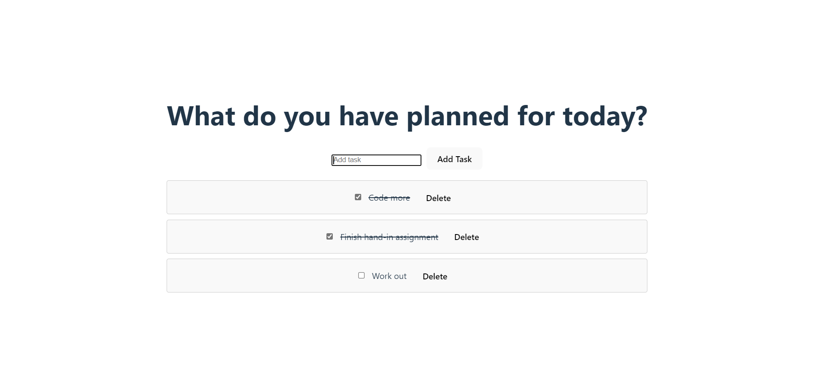

### To Do App

Simple to do app built in Vue with functionallity to add new todos, mark todos as done and delete todos.


### Built with

- Vue
- LocalStorage

### Installation

1. Clone the repo
   ```sh
   https://github.com/fanniewallner/Todo.vue.git
   ```
2. Install dependencies
   ```sh
   npm i
   ```
3. Run the app
   ```sh
   npm run dev
   ```
